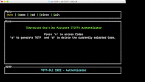

# CLI-TOTP-AUTHENTICATOR

`cli-totp-authenticator` is a CLI that allows generating a Time-Based One-Time Password according to how it is defined in [rfc6238](https://datatracker.ietf.org/doc/html/rfc6238)  

## 1.  Features 

- Add an account and a "key" to generate a one time password 
- a list of one time passwords with timer 
- ability to delete an account or create new one 

## 2.  Important 
For the time being this product is in alpha and is not considered production ready. use it at your own risk 

### Cargo Install

The simplest way to start playing around with `cli-totp-authenticator` is to have `cargo` build. If you are not familiar with rust and cargo: [Getting Started with Rust](https://doc.rust-lang.org/book/ch01-00-getting-started.html)

